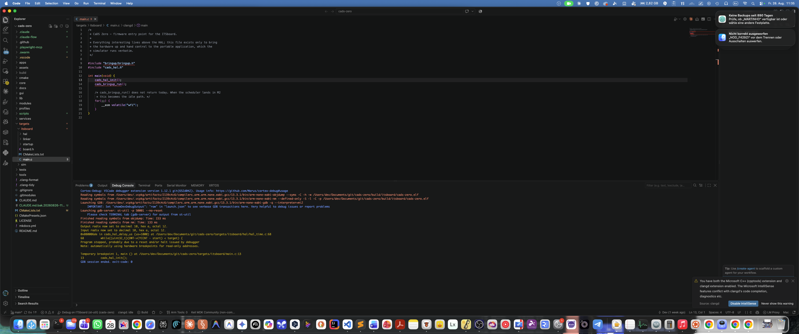
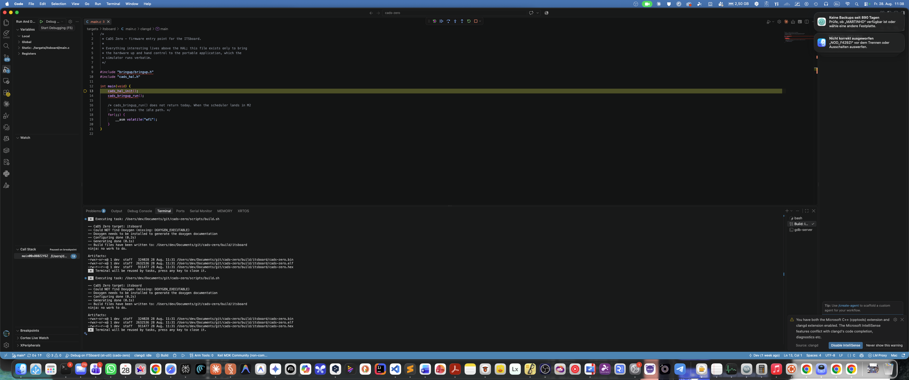
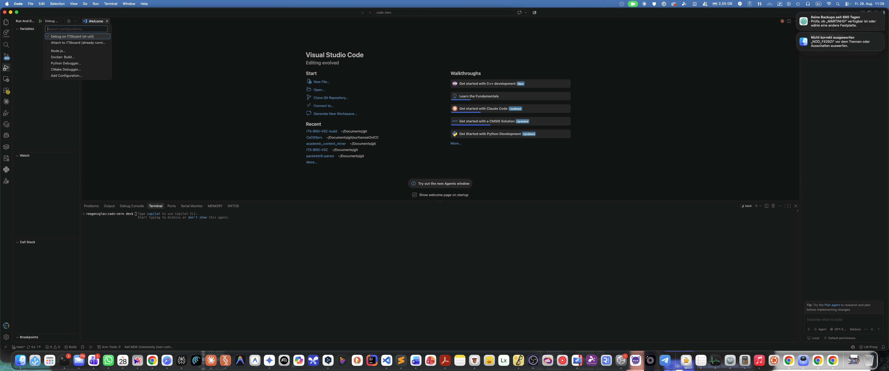
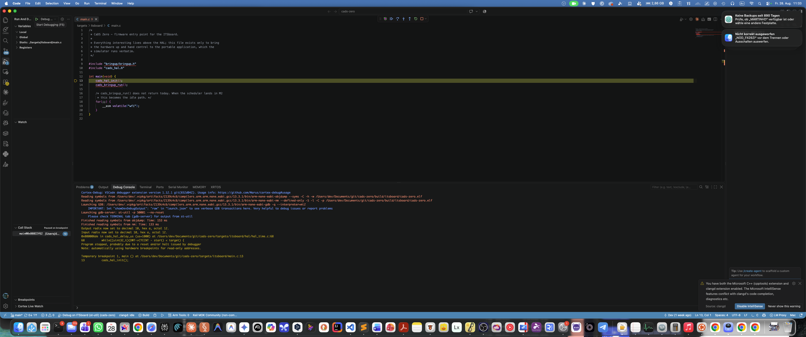
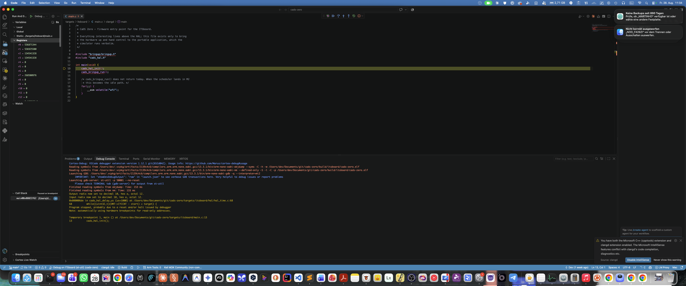
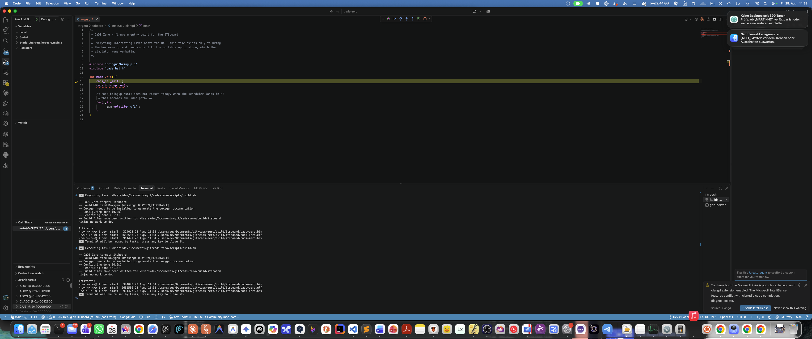
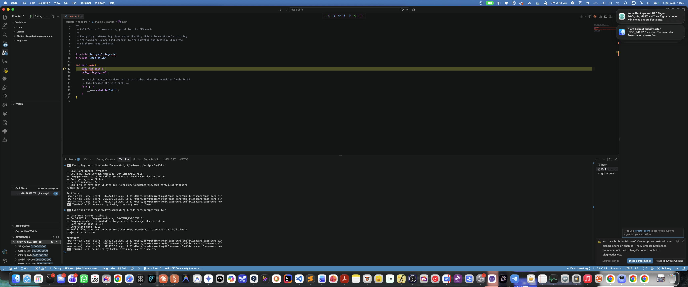

# Set up VS Code

Everything in this page is free — no paid extension, no account, no trial.
The repo ships working `.vscode/` config (`extensions.json`, `settings.json`,
`tasks.json`, `launch.json`) and a `CMakePresets.json` at the root, so most
of this is "open the folder and say yes" rather than manual setup. The
whole flow below — open, build, flash, debug, inspect real peripheral
registers — is driven through VS Code's own native UI (status bar, the
Activity Bar's Run and Debug panel, CMake Tools' target picker), not
Command Palette gymnastics or a custom task menu you have to remember.

## 1. Get a toolchain on `PATH`

`scripts/build.sh` (and the CMake presets below) look for `arm-none-eabi-gcc`
via `CADS_ARM_TOOLCHAIN_BIN`, then fall back to plain `PATH` — see
[Build the firmware](build.md#toolchain). For VS Code specifically, `PATH` is
the simpler option: the debugger extension resolves `arm-none-eabi-gdb` the
same way, with no environment variable to keep in sync between your shell and
however VS Code itself gets launched.

```bash
# macOS
brew install --cask gcc-arm-embedded

# Debian/Ubuntu
sudo apt install gcc-arm-none-eabi

# then, either shell:
arm-none-eabi-gcc --version   # confirm it's on PATH
```

You'll also want `cmake` (≥ 3.21 for the presets file, though the project's
own floor is 3.20), `ninja`, and `st-link` (for `st-flash`/`st-util`) —
`brew install cmake ninja stlink` / `apt install cmake ninja-build stlink-tools`.

### Windows

Be aware going in: several pieces of this project's tooling are bash
scripts or use the POSIX-only `termios` module, so "Windows" really means
choosing between two genuinely different levels of support — this isn't
guesswork, it's what's actually in the scripts:

- **`scripts/build.sh` / `scripts/flash.sh`** (and so the "Build: ITSboard
  firmware" and "Flash: ITSboard over ST-Link" tasks in `tasks.json`, and
  the `flash` CMake target in §4) are `#!/usr/bin/env bash` scripts —
  PowerShell/cmd can't run them directly.
- **`scripts/cads_serial.py`** (so `scripts/board_cmd.py` and anything else
  that opens the console) imports Python's `termios` module directly, which
  **does not exist on native Windows Python at all** — not a missing
  package, an immediate `ImportError`. There is no workaround short of a
  Windows-specific rewrite this project doesn't have.

**WSL2 — the path that actually gets you everything.** Install a WSL2
Debian/Ubuntu distro, then follow the Debian/Ubuntu instructions above
*inside* WSL — every script in this repo, including the console tooling,
runs unmodified there. The one extra step: WSL2 doesn't see USB devices by
default, so the ST-Link needs passing through from Windows with
[usbipd-win](https://github.com/dorodnic/usbipd-win) (`usbipd bind`/`usbipd
attach --wsl`, run from an elevated Windows prompt each time you replug).
Once attached, it enumerates as `/dev/ttyACM0` (or similar), not
`/dev/cu.usbmodem*` — pass `--port /dev/ttyACM0` to `board_cmd.py`, or
export `CADS_CONSOLE_PORT=/dev/ttyACM0`, since the port auto-detect in
`cads_serial.py` only looks for macOS device names. Open the *WSL* copy of
the repo in VS Code with the [WSL
extension](https://marketplace.visualstudio.com/items?itemName=ms-vscode-remote.remote-wsl)
(`code .` from the WSL shell) so CMake Tools, cpptools, and cortex-debug all
run against the Linux toolchain and the Linux `st-util`/`st-flash` — mixing
a Windows-side VS Code with a WSL-side toolchain is where this stops working.

**Native Windows — build, flash, and debug all work; only the console
scripts don't.** If you'd rather not use WSL: install the [Arm GNU
Toolchain](https://developer.arm.com/downloads/-/arm-gnu-toolchain-downloads)
Windows installer (adds `arm-none-eabi-gcc` to `PATH` for you; also
installable via `winget install Arm.ArmGnuToolchain`, though that package
currently only offers machine-wide install — no `--scope user`, so it needs
an admin/UAC prompt once), `cmake` and `ninja` (via their own installers,
`winget`, or `choco`), and the ST-Link Windows tools. The [official ST-Link
Windows tools](https://www.st.com/en/development-tools/stsw-link009.html)
work; so does the open-source
[stlink-org/stlink](https://github.com/stlink-org/stlink/releases) Windows
build (`st-flash`/`st-info`/`st-util` in one zip) if you'd rather not
install ST's own package — that build needs `libusb-1.0.dll` next to the
`.exe`s, which the zip does not include (the `libusb` PyPI package
bundles a working one:
`pip install libusb`, then copy
`Lib\site-packages\libusb\_platform\windows\x86_64\libusb-1.0.dll`
alongside `st-flash.exe`/`st-info.exe`/`st-util.exe`), and it looks for its
chip database at a hardcoded `C:\Program Files (x86)\stlink\config` — copy
the zip's own `config\` folder there (needs the same one-time admin
elevation) or `st-info --probe`/`st-flash` still run but report
`flash: 0 (pagesize: 0)` instead of the real chip's size.

CMake Tools' `itsboard`/`host` presets, cpptools, and cortex-debug (§5) all
work natively this way — none of them shell out to a `.sh` script. What
doesn't: the two `tasks.json` entries that do (build via
`cmake --preset itsboard && cmake --build --preset itsboard` directly
instead, which is exactly what `build.sh` itself wraps), the `flash` CMake
target (use `st-flash --serial <id> --reset write build\itsboard\cads-
zero.bin 0x08000000` by hand instead, or install Git for Windows and point
VS Code's default shell at its bundled `bash.exe` so the scripts resolve),
and anything under `scripts/*.py` that touches the serial console. Debugging
by hand works the same way as [Debug with GDB](debug.md) describes, with
`st-util.exe`/`arm-none-eabi-gdb.exe` in place of the Unix names — including
its `detach`/`quit` gotcha: `st-util`'s GDB stub doesn't implement `detach`
("Remote doesn't know how to detach"), and on Windows specifically, if GDB's
stdin is redirected from a closed/empty source (a non-interactive script
runner rather than a real terminal), a bare `quit` after that re-prompts
"Quit anyway?" in a loop it can never answer — send GDB itself a `kill`
(not `-9`) instead of `detach`+`quit` in that situation. Verified end to
end on real hardware (NUCLEO-F429ZI + ITS adapter, native Windows 11, no
WSL): build → `st-flash write` → `st-util` + `arm-none-eabi-gdb` stopped
exactly at `main()`, backtrace and register read both correct, ST-Link left
in a clean, non-wedged state afterward.

**A pre-existing toolchain-resolution bug, Windows-only, fixed as of this
PR:** when `CADS_ARM_TOOLCHAIN_BIN` points at a real toolchain (the winget
one above, or any full-path install), `cmake/arm-none-eabi-gcc.cmake` used
to set `CMAKE_C_COMPILER` etc. to `<bin>/arm-none-eabi-gcc` with no `.exe`
suffix. CMake's compiler-identification step still ran the command fine
(Windows resolves `PATHEXT` for a *launched* command either way) and printed
`The C compiler identification is GNU 12.2.1` — but its later, stricter
literal-path check then failed with `is not a full path to an existing
compiler tool`, because that check does not apply `PATHEXT` the way running
the command does. Plain `arm-none-eabi-gcc` with no `CADS_ARM_TOOLCHAIN_BIN`
(rely on `PATH`) never hit this — `PATH` search already handles the
extension. Never surfaced before because this project's own reference
machine is a Mac; the fix appends `.exe` to every tool path, but only in the
`CADS_ARM_TOOLCHAIN_BIN` branch and only when `CMAKE_HOST_WIN32`, so
nothing changes on macOS/Linux or on the plain-PATH branch.

If you'd rather use the exact toolchain version this project's own reference
machine has (installed via the vcpkg-artifacts mechanism the Arm Keil Studio
Pack extension manages), that still works — set `CADS_ARM_TOOLCHAIN_BIN` to
its `bin` directory, in your shell's rc file (`~/.zshrc` / `~/.bashrc`), not
just for one terminal session.

**Whichever route you take, make it durable, not just "works in this one
terminal."** VS Code, once started, does not notice a `PATH` change in some
*other* terminal you opened afterward — and if VS Code is already running
when you open a new terminal window and type `code .`, that just opens a new
window in the *same, already-running* process with whatever environment it
started with. If `cortex-debug` ever reports `GDB executable
"arm-none-eabi-gdb" was not found`, the fix is: put the toolchain on `PATH`
in your shell's rc file (so every *new* terminal has it, not just the one
where you happened to run an export), then **fully quit VS Code** (not just
close the window — `Cmd+Q` / quit from the Dock, or the toolchain fix still
won't reach it) and reopen it from a fresh terminal.

## 2. Install the extensions

Open the folder in VS Code. It will offer to install the four recommended
extensions from `.vscode/extensions.json` — accept, or install by hand:

| Extension | ID | What it's for |
|---|---|---|
| CMake Tools | `ms-vscode.cmake-tools` | Reads `CMakePresets.json`, gives you a status-bar picker for the `itsboard`/`host` presets, drives configure/build/test without typing CLI commands. |
| C/C++ | `ms-vscode.cpptools` | IntelliSense, go-to-definition, and inline diagnostics — fed the *real* compiler flags from whichever preset is active via `compile_commands.json` (already enabled project-wide, `CMAKE_EXPORT_COMPILE_COMMANDS=ON`), not a guess at your setup. Also where formatting and linting live — see §6. |
| Cortex-Debug | `marus25.cortex-debug` | Breakpoints, variable inspection, and a real peripheral-register tree on the real board, driving `st-util` for you instead of typing the raw GDB session from [Debug with GDB](debug.md) by hand every time. |
| Python | `ms-python.python` | Editing/running `scripts/*.py` (`board_cmd.py`, `cads_config.py`, `board_test.py`, ...) — all dependency-free stdlib Python, so this is the only Python tooling you need. |

Nothing ESP32/Arduino-specific is on this list on purpose — see §5. If you
also have **Arm Keil Studio Pack** installed (for a different project, say)
it can coexist in the same VS Code install without conflict — its own status
bar items (an Arm Tools/Keil MDK indicator) will just show up alongside
these; nothing here depends on it being absent, and nothing here touches its
configuration.



## 3. Build both targets

The status bar (bottom of the window, once CMake Tools is active) shows the
current preset. Pick **itsboard** or **host**, then either use CMake Tools'
own status-bar build button or **Terminal → Run Task**:

- **Build: ITSboard firmware** — the real board image, via `scripts/build.sh`.
- **Build: Host (sim + unit tests)** — the SDL2 simulator and the full test
  suite, native compiler, no ARM toolchain needed for this one.
- **Test: Host unit tests** — `ctest --preset host`, all 30+ unit and
  golden-image tests.

These call the exact same scripts and CMake presets the command line uses
(`scripts/build.sh`, `cmake --preset host`) — nothing VS-Code-specific about
what actually runs, only how you trigger it.



## 4. Flash on real hardware

`scripts/flash.sh` is also reachable as a genuine **CMake target** called
`flash`, not only through the task menu — CMake Tools' own target picker
(the CMake icon in the Activity Bar → Project Outline, or the target name in
the status bar) lists it alongside `cads-zero.elf`, so building it is the
same one click as building anything else. It depends on `cads-zero.elf`, so
it always flashes the freshest build. From a terminal (including VS Code's
own integrated one) it's:

```bash
cmake --build build/itsboard --target flash
```

which delegates to `scripts/flash.sh` itself — see
[Flash the board](flash.md) for what that script does and the safety
constraints (`docs/SAFETY.md`) it respects; this target doesn't reimplement
any of that, just calls the one script that already gets it right.

## 5. Debug and inspect real registers

Open the **Run and Debug** panel (the Activity Bar icon that looks like a
play button with a bug, a few icons below Search — or `Cmd/Ctrl+Shift+D`).
The dropdown at the top already lists both configs from `.vscode/launch.json`:



- **Debug on ITSboard (st-util)** — builds, flashes, and stops at `main()`
  with breakpoints available. This is [Debug with GDB](debug.md)'s
  `st-util` + `arm-none-eabi-gdb` session, wired into VS Code's UI instead of
  two terminal windows.
- **Attach to ITSboard (already running)** — no reset, no reflash: attaches
  to the board exactly as it is. This is the technique
  [Debug with GDB](debug.md#when-the-firmware-faults-read-the-console-first)
  describes for reading a halted fault handler's evidence — resetting first
  would destroy exactly what you're trying to inspect.

With a config selected, hit the green play button (or `F5`). On real
hardware this stops exactly where `runToEntryPoint` says (`main()`), with a
live call stack, variables, and full breakpoint/step controls — the Debug
Console shows the real launch sequence (`arm-none-eabi-gdb` from the
resolved toolchain, `st-util` as the GDB server, "Temporary breakpoint 1,
main ()"), not a simulated one:



**Registers.** The Variables panel's own **Registers** section gives the
core registers (`r0`-`r15`, `xPSR`, ...) with nothing extra to configure:



**Peripheral registers — the part that actually matters for embedded work.**
Raw core registers rarely answer the question you have ("is `RCC->CR`
showing HSE ready?", "what does `GPIOA->ODR` actually hold right now?"). A
vendored SVD file (`targets/itsboard/STM32F429.svd`, STMicroelectronics'
own, Apache-2.0, the same licence as the `cmsis_device_f4` submodule already
in `lib/`) is wired into both `launch.json` configs via `"svdFile"`, which
gives `cortex-debug` a full named-peripheral tree — a real **XPeripherals**
panel appears in the Run and Debug sidebar once a session is active:



Expand any one of them for its actual named registers, live:



This is the de facto standard way to inspect registers in a VS Code
embedded workflow — no separate "Peripheral Inspector" extension needed,
`cortex-debug` already does it once a matching SVD file is configured.

Both debug configs assume one ST-Link attached. With two on the same Mac,
add `"serialNumber": "<id>"` to the relevant config in `.vscode/launch.json`
(find the id with `st-info --probe`).

## 6. Linting and formatting

Both are already on by default (`.vscode/settings.json`) and both read
config files checked into the repo root, so there's nothing to configure -
only, for linting, one more tool to install.

**Formatting** (`.clang-format`, curated against this codebase's own real
style - 4-space indent, attached braces, indented `case` labels, short
`if(x) return;` bodies kept on one line) works with nothing extra: `ms-
vscode.cpptools` ships its own bundled `clang-format`, so **format on
save** just works the moment the extension is installed. Format-on-save is
scoped to C/C++ files only (`"[c]"`/`"[cpp]"` in settings.json), so it
never touches the Python scripts or the vendored submodules under `lib/`.

**Linting** (`.clang-tidy` - `bugprone-*`/`clang-analyzer-*` plus a
handful of individually-checked `readability-*`/`performance-*` rules;
deliberately *not* the rest of `readability-*` wholesale, which fights
this codebase's own conventions on things like literal suffixes and
single-line `if` bodies - see the file's own header comment for the real
numbers this was tuned against) needs an actual `clang-tidy` binary,
which `cpptools` does not bundle:

```bash
# macOS
brew install llvm
# then add its (keg-only - not linked onto PATH by default) bin dir:
echo 'export PATH="/opt/homebrew/opt/llvm/bin:$PATH"' >> ~/.zshrc
# open a new terminal (or `source ~/.zshrc`), then confirm:
clang-tidy --version

# Debian/Ubuntu
sudo apt install clang-tidy
```

Once `clang-tidy` is on `PATH`, fully quit and reopen VS Code (the same
"a running process doesn't notice a later `PATH` change" caveat from §1
applies here too) so `cpptools` picks it up. Findings show up as squiggly
underlines in the editor and in the **Problems** panel, the same as a
compiler warning.

## 7. The ESP32/Marauder side

No dedicated Arduino/ESP-IDF extension is on the recommended list — the
WiFi co-processor's firmware is built entirely by
`tools/marauder-build/build_and_flash.sh` (wired up as the **Build:
ESP32Marauder co-processor** task), which drives `arduino-cli` directly. See
[wifi-coprocessor.md](../reference/wifi-coprocessor.md) for the wiring and
[marauder-coprocessor.md](../reference/marauder-coprocessor.md) for the build
itself. If you want editor support while reading or patching the vendored
Marauder C++ source, `ms-vscode.cpptools` (already installed for the STM32
side) handles plain C++ syntax/navigation fine without a second, heavier
Arduino-specific extension — this codebase's own C/C++ files and Marauder's
are different languages of the same family, not different tooling.

## How this differs from ITS-BRD-VSC

[Transport-Protocol/ITS-BRD-VSC](https://github.com/Transport-Protocol/ITS-BRD-VSC)
is HAW Hamburg's other ITSboard example (an lwIP teaching project). It's
worth naming directly and being blunt about the difference, because it
isn't a small stylistic choice: ITS-BRD-VSC's whole workflow is built on
top of one vendor extension (Arm Keil Studio Pack) and its own project
format. CaDS Zero deliberately does the opposite — everything in this page
is **VS Code's own default tooling plus mainstream, single-purpose
extensions** (CMake Tools, cpptools, cortex-debug) driving a plain CMake
project. Nothing here is CaDS-Zero-specific glue that only works because of
some other extension's cache, config format, or project model.

| | ITS-BRD-VSC | CaDS Zero |
|---|---|---|
| Project format | CMSIS-Solution (`.cproject.yml`/`.csolution.yml`) — a vendor-defined project model | Plain CMake (`CMakeLists.txt` + `CMakePresets.json`) — the de facto standard for C/C++, understood by every IDE and every CI system |
| Build UI | Keil Studio Pack's own CMSIS panel | CMake Tools' native status bar/target picker — the same `cmake --preset` a terminal, CLion, or CI would run, with no VS Code involved at all |
| Toolchain | Arm Keil Studio Pack (MDK 6, Community licence) — tied to that extension | Homebrew/apt `arm-none-eabi-gcc`, or the vcpkg-artifacts mechanism as an alternative — either way, a toolchain you could point *any* build system at |
| Extensions needed | Keil Studio Pack (bundles ~7 Arm-specific extensions), clangd, Memory/Peripheral Inspector | 4 mainstream, single-purpose extensions — CMake Tools, cpptools, cortex-debug, Python |
| Peripheral registers | Keil's own Peripheral Inspector view | `cortex-debug`'s native SVD support — a vendored, Apache-2.0 SVD file, same result, no extra extension needed |
| Build without hardware | Not covered — the project targets the real board only | `build/host`: the full GUI runs in an SDL2 window, and the entire unit/golden-image suite runs, with no board attached |
| Second co-processor toolchain | N/A | ESP32/Arduino side integrated in the same repo (`tools/marauder-build/`) |
| Linting | clangd's own diagnostics | A curated `.clang-tidy`, tuned against this codebase's real output rather than left at stock defaults |
| Portability of what you learn | Tied to Keil Studio Pack's own project format and panels | Presets, `compile_commands.json`-driven IntelliSense, and `cortex-debug` + SVD are all plain, transferable VS Code/CMake mechanics |

**The honest trade-off, not just the CaDS Zero side of it:** Keil Studio
Pack is the vendor-blessed path, and for someone who wants Arm's own
project wizards, its Pack management (auto-fetching CMSIS packs by version),
and its polished Memory/Peripheral Inspector UI out of the box, it's a
genuinely good, well-integrated experience — you install one extension and
most of the STM32-specific plumbing is done for you. What it costs is
portability and transparency: your build only really makes sense inside
that one extension's project model, and if it ever breaks, you're debugging
Keil's own tooling, not a build system you already know from elsewhere.

**What CaDS Zero's approach can now definitely do that ITS-BRD-VSC's setup
doesn't:**

- **Build and fully exercise the firmware with zero hardware attached** —
  `build/host` runs the real GUI in an SDL2 window and the entire unit/
  golden-image test suite. ITS-BRD-VSC has no equivalent; its workflow
  assumes a board is on the desk.
- **Work identically outside VS Code** — `cmake --preset itsboard && cmake
  --build build/itsboard` (or `--preset host`) is the *entire* build,
  runnable from any terminal, any CI runner, or any other IDE that reads
  CMakePresets.json. Nothing is trapped inside one extension's UI.
- **Drive two independent toolchains from one project** — the STM32 side
  (plain CMake/ARM GCC) and the ESP32/Marauder co-processor side (Arduino
  CLI, `tools/marauder-build/`) live in the same repo without either one
  needing the other's extension installed.
- **Coexist cleanly with a completely different toolchain in the same VS
  Code install** — because nothing here depends on Keil Studio Pack being
  present *or* absent, this setup and ITS-BRD-VSC's can genuinely sit
  side by side in one VS Code, each on its own project, neither touching
  the other's configuration (see §2).
- **Give real peripheral-register inspection without installing anything
  beyond what's already recommended** — the vendored SVD file (§5) gets
  cortex-debug's native XPeripherals tree "for free," rather than needing
  Keil's separate Peripheral Inspector extension.

None of that makes CMSIS-Solution the wrong choice for a project that's
committed to the Arm ecosystem end to end — it makes CaDS Zero's choice the
right one for a project that wants to stay buildable, debuggable, and
readable by anyone with a normal CMake+VS Code setup, on a board they may
not physically have in front of them yet.

## Troubleshooting

- **CMake Tools can't find a compiler for the `itsboard` preset**, or
  **`cortex-debug` reports `GDB executable "arm-none-eabi-gdb" was not
  found`** — the toolchain isn't on the `PATH` the *running* VS Code process
  actually has. See §1's durability note: fix your shell rc, then fully quit
  (not just close the window) and reopen VS Code from a fresh terminal.
- **The `XPeripherals` panel shows "No active debug session"** — that's
  correct and expected outside of an active debug session; it populates
  once you start one (§5).
- **Flash/debug fails right after a firmware update to `st-link`, or the
  probe seems to vanish** — see
  [Flash the board](flash.md) and [Debug with GDB](debug.md) for the
  probe-sharing and stale-server pitfalls; both apply the same way whether
  you're driving `st-flash`/`st-util` from a terminal or through this page's
  native UI.
